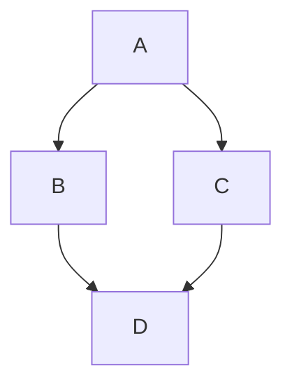

# Jekyll + Github Pages 测试

欢迎访问 Jekyll + Github Pages 测试

## Primer-Spec theme 测试

以下是关于 primer-spec theme 的测试情况。

### 基本用法

参考 [https://github.com/eecs485staff/primer-spec](https://github.com/eecs485staff/primer-spec)：

- 在 webpage 顶部增加

```markdown
---
layout: spec
---
```

- 在网站 root 目录下增加 `_config.yml`。主要内容如下：

```yml
remote_theme: eecs485staff/primer-spec
plugins:
  - jekyll-remote-theme
  - jekyll-optional-front-matter
  - jekyll-readme-index
  - jekyll-relative-links
  - jemoji
kramdown:
  input: GFM
readme_index:
  remove_originals: true
  with_frontmatter: true
```

### 测试 callout

<!--  -->
测试 callout。参考文档：[https://eecs485staff.github.io/primer-spec/demo/callouts.html](https://eecs485staff.github.io/primer-spec/demo/callouts.html)

Primer Spec offers five variants of callouts:
- neutral
- info
- warning
- danger
- success

**neutral**
<div class="primer-spec-callout" markdown="1">
  **Pro tip:** Use this to create a simple note box. It's weaker than `info`, but offers stronger emphasis than main body text.
</div>

**info**
<div class="primer-spec-callout info" markdown="1">
  **Pro tip:** Use this for additional information, context or hints.
</div>

**warning**
<div class="primer-spec-callout warning" markdown="1">
  **Pro tip:** Use this to alert readers or when extra care/attention is needed.
</div>

**danger**
<div class="primer-spec-callout danger" markdown="1">
  **Pro tip:** Use this to caution readers about dangerous outcomes (or when something won't work as expected).
</div>

**success**
<div class="primer-spec-callout success" markdown="1">
  **Pro tip:** Use this to celebrate an achievement!
</div>

### 测试 Jekyll 定制

`_config.yml` 增加：


```yml
title: Github Pages + Jekyll Test
description: test Github Pages + Jekyll + Theme
favicon: /assets/favicon/blog-solid-full.svg
```

### 显示在侧边栏

阿是砥砺奋进啊两地分居阿发

### 不显示在侧边栏
{: .primer-spec-toc-ignore }

阿斯蒂芬开讲啦地方

### 增强的代码块

在代码块下方输入 `{: data-highlight="3-6,12" }`，可以高亮显示3到6行、12行。

```python
import datetime

def main():
    print("=" * 40)
    print("Hello World!")
    print("=" * 40)
    
    # 获取当前时间
    now = datetime.datetime.now()
    
    # 输出不同格式的时间信息
    print(f"当前日期和时间: {now.strftime('%Y-%m-%d %H:%M:%S')}")
    print(f"当前日期: {now.strftime('%Y年%m月%d日')}")
    print(f"当前时间: {now.strftime('%H时%M分%S秒')}")
    
    # 星期几（中文）
    weekdays = ["星期一", "星期二", "星期三", "星期四", "星期五", "星期六", "星期日"]
    print(f"今天是: {weekdays[now.weekday()]}")
    
    # 时间戳
    print(f"时间戳: {int(now.timestamp())}")
    
    print("=" * 40)

if __name__ == "__main__":
    main()
```
{: data-highlight="3-6,12" }

<!--  -->
或者，在代码中增加 `# primer-spec-highlight-start` 和 `# primer-spec-highlight-end` ，期间的代码也可以高亮。

```python
import datetime

def main():
    print("=" * 40)
    print("Hello World!")
    print("=" * 40)
    
    # 获取当前时间
    now = datetime.datetime.now()
    
    # primer-spec-highlight-start
    # 输出不同格式的时间信息
    print(f"当前日期和时间: {now.strftime('%Y-%m-%d %H:%M:%S')}")
    print(f"当前日期: {now.strftime('%Y年%m月%d日')}")
    print(f"当前时间: {now.strftime('%H时%M分%S秒')}")
    # primer-spec-highlight-end
    
    # 星期几（中文）
    weekdays = ["星期一", "星期二", "星期三", "星期四", "星期五", "星期六", "星期日"]
    print(f"今天是: {weekdays[now.weekday()]}")
    
    # 时间戳
    print(f"时间戳: {int(now.timestamp())}")
    
    print("=" * 40)

if __name__ == "__main__":
    main()
```
{: data-highlight="3-4" }

<!--  -->
console 高亮显示。代码块语言是 `console`。

```console
~/gdweb/wstt % pwd
/Users/george1442/gdweb/wstt
~/gdweb/wstt % tree
.
└── docs
    ├── README.md
    ├── _config.yml
    ├── _data
    │   └── navigation.yml
    ├── _includes
    │   └── navigation.html
    ├── _layouts
    │   └── default.html
    ├── about.md
    ├── assets
    │   └── favicon
    │       └── blog-solid-full.svg
    ├── bk-index.html
    └── guide.md

7 directories, 9 files
~/gdweb/wstt % ls
docs
~/gdweb/wstt % cd docs
~/gdweb/wstt/docs % ls
README.md     _data         _layouts      assets        guide.md
_config.yml   _includes     about.md      bk-index.html
~/gdweb/wstt/docs % cat about.md
---
layout: default
title: About
---

# About page

This page tells you a little bit about me.
title is {{ page.title }}.
```

console 高亮（样例2）

```console
$ pwd
/Users/awdeorio/src/eecs485/p2-insta485-serverside
$ tree insta485/static/
insta485/static/
├── css
│   └── style.css
└── images
    └── logo.png
$ touch insta485/model.py
$ mapreduce-manager \
    --host localhost \
    --port 6000 \
    --hb-port 5999 \
    --log-file mapreduce-manager.log &
Error: Not implemented
```
{: data-highlight="1,3,9" data-title="markdown" }
```

<!--  -->
还可以给代码块加标题。在代码块后面加 `{: data-title="打印时间的各种格式" }`。

```python
import datetime

def main():
    print("=" * 40)
    print("Hello World!")
    print("=" * 40)
    
    # 获取当前时间
    now = datetime.datetime.now()
    
    # primer-spec-highlight-start
    # 输出不同格式的时间信息
    print(f"当前日期和时间: {now.strftime('%Y-%m-%d %H:%M:%S')}")
    print(f"当前日期: {now.strftime('%Y年%m月%d日')}")
    print(f"当前时间: {now.strftime('%H时%M分%S秒')}")
    # primer-spec-highlight-end
    
    # 星期几（中文）
    weekdays = ["星期一", "星期二", "星期三", "星期四", "星期五", "星期六", "星期日"]
    print(f"今天是: {weekdays[now.weekday()]}")
    
    # 时间戳
    print(f"时间戳: {int(now.timestamp())}")
    
    print("=" * 40)

if __name__ == "__main__":
    main()
```
{: data-highlight="3-4" }
{: data-title="打印时间的各种格式" }

<!--  -->
不显示行号。在代码块后面增加 `{: data-variant="no-line-numbers"}`。

```python
import datetime

def main():
    print("=" * 40)
    print("Hello World!")
    print("=" * 40)
    
    # 获取当前时间
    now = datetime.datetime.now()
    
    # primer-spec-highlight-start
    # 输出不同格式的时间信息
    print(f"当前日期和时间: {now.strftime('%Y-%m-%d %H:%M:%S')}")
    print(f"当前日期: {now.strftime('%Y年%m月%d日')}")
    print(f"当前时间: {now.strftime('%H时%M分%S秒')}")
    # primer-spec-highlight-end
    
    # 星期几（中文）
    weekdays = ["星期一", "星期二", "星期三", "星期四", "星期五", "星期六", "星期日"]
    print(f"今天是: {weekdays[now.weekday()]}")
    
    # 时间戳
    print(f"时间戳: {int(now.timestamp())}")
    
    print("=" * 40)

if __name__ == "__main__":
    main()
```
{: data-highlight="3-4" }
{: data-title="打印时间的各种格式" }
{: data-variant="no-line-numbers"}

### 页面级别的设置

支持以下页面级别的设置：

```yml
---
layout: spec

# Disable the Sidebar completely
disableSidebar: true

# Prevent the sidebar (with table of contents) from appearing when a user loads the page. Defaults to false
hideSidebarOnLoad: Boolean

# Render LaTeX expressions
latex: true

# Render diagrams using Mermaid syntax and rendering
mermaid: true
---
...your webpage's MarkDown/HTML content...

```

**测试 LaTeX**

LaTeX can be inlined ($$ \forall x \in R $$) or as a separate math block.

$$
-b \pm \sqrt{b^2 - 4ac} \over 2a
$$

**测试 Mermaid**

Use Mermaid to render flow charts, sequence diagrams and more!



{:
  data-title="Basic example of a flowchart"
  data-description="A links to B and C. B and C link to D."
}